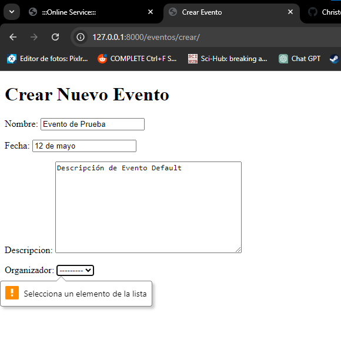
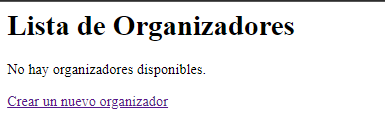
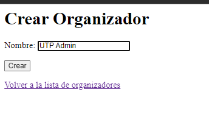
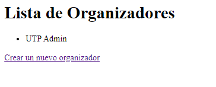
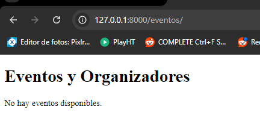
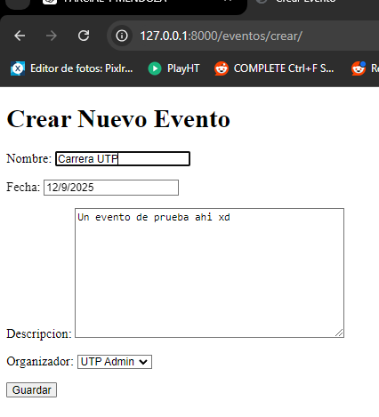
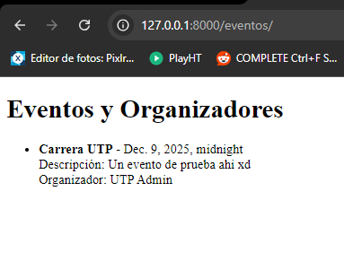

# Parcial 1 - Christopher Serrano

Funcionalidades principales:
1.	Gestión de Organizadores:
•	Crear organizadores que podrán gestionar múltiples eventos.
•	Listar todos los organizadores registrados.
2.	Gestión de Eventos:
•	Crear, listar y editar eventos asociados a los organizadores.
•	Validar los datos del evento, asegurando que los nombres no contengan ciertas palabras restringidas.
3.	Autenticación de Usuarios:
•	Protege ciertas vistas sensibles, como la edición de eventos, asegurando que solo los usuarios autenticados puedan acceder.

Objetivos del proyecto:
•	Aplicar conceptos básicos y avanzados de Django, como modelos, formularios y vistas basadas en clases.
•	Implementar relaciones entre modelos (uno a muchos).
•	Usar formularios de Django con validaciones personalizadas.
•	Proteger vistas utilizando el sistema de autenticación de Django.

Actualización (5 de septiembre de 2024):

actualmente permite registrar eventos nuevos. Sin embargo, se está utilizando un dropdownlist para escoger organizadores, pero no hay organizadores registrados y por ende, no se pueden registrar eventos.

Actualización (6 de septiembre de 2024):

Desarrollado el punto 2.4, ahora se pueden añadir organizadores a la lista, y por ende, añadir eventos:

Seccion de Organizadores (/organizadores/ y /organizadores/crear/):

Ahora, en la sección de Eventos (/eventos/ y /eventos/crear/):

